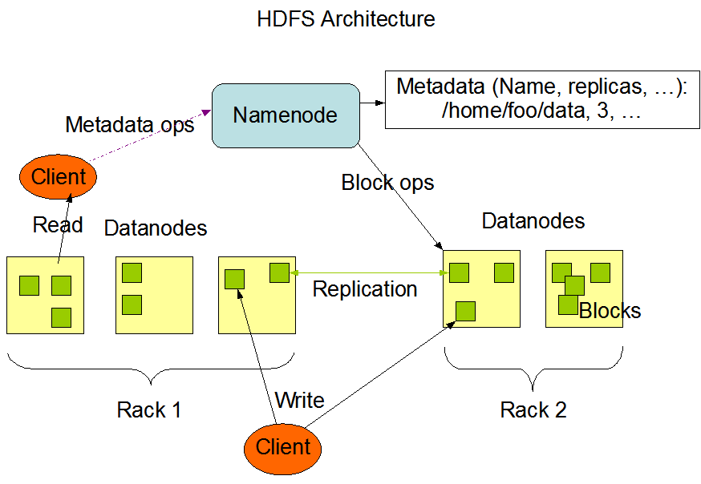
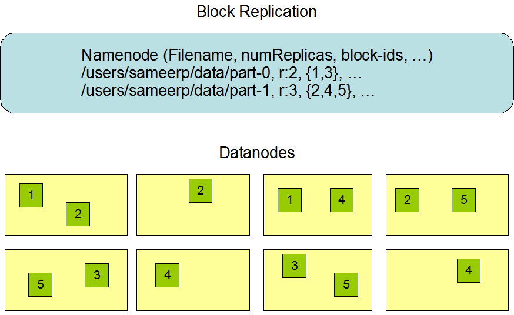

## HDFS 아키텍처
- 개론: HDFS는 내결함성을 가지고 저비용으로 설계된 시스템이다. HDFS는 애플리케이션에서 발생하는 높은 처치량 소화 가능하며 거대한 데이터를 다룰 때 사용된다.
- 목적: 

1. Hardware Failure
 HDFS 인스턴스는 수백~수천개의 가용 가능한 서버 머신을 통해 구성된다. 많은 수로 구서된 서버가 동시에 마비될 확률이 적은점이 HDFS의 안정성을 높이며
빠른 실패 감지와 자동적인 회복이 HDFS의 핵심적인 기능이다.

2. Streaming Data Access
 HDFS에서 구동되는 애플리케이션은 별도의 스트리밍 처리가 필요하다. 유저와 실시간 상호작용하는 것보다는 배치처리가 HDFS 처리 방식의 기본이다.
핵심은 데이터에 대해 적은 지연율보다는 높은 처리량이다. 한 개의 클러스터에 다중 노드 운영한다.

3. Simple Cohereny Model
 HDFS 시스템은 한번 읽지만 많은 데이터 조회 가능한 방식을 지원한다. 파일이 생성된다면 수정은 지원되지 않는다. 이 방식은 데이터의 coherency를 간단히 해주고
높은 데이터 처리량을 위해 설계되었다. MapReduce와 웁 크롤링 어플리케이션이 이상적으로 이 모델에 적합하다.

4. Moving Computation is cheaper than moving data
 연산 과정이 물리적으로 인접할 경우 특히 데이터의 양이 방대할수록 더 효율적인 연산이 된다. 이 시스템은 ㄴ트워크 혼잡을 줄여주고 전체적인 처리량을 올려준다.

5. Portability Across Heterogeneous Hardware and Software Platforms
HDFS는 다른 플랫폼으로 쉽게 이동 가능하게 설계되었다. 이것은 HDFS의 adoption을 높여주고 많은 플랫폼과 연동성이 높아진다.

<br/>

***

<br/>

## NameNode와 DataNode
#### HDFS는 master, worker 노드로 구성되어 있는 아키텍쳐이다. HDFS 클러스터는 하나의 파일 시스템을 클라이언트엑 접근 가능하게 해주는 마스터 노드 한개로 구성되어 있다. 
#### 클러스터에는 많은 수의 데이터노드가 있으며 주로 하나의 실행되는 노드는 저장소를 관리해준다. 내부적으로 파일은 여러개의 블럭으로 나누어져 있으며 데이터 노드들에 복제되어 분산저장되어 있다. 마스터 노드는 파일 시스템의 네임 스페이스를 열고, 닫고, 재설정해주는 등 관리하는 역할을 한다. 
#### 이것은 데이터 노드와 맵핑해주는 것을 의미하기도 한다. 데이터 노드는 읽고 쓰고 파일 시스템을 클라이언트에게 요청해주는 역할을 한다. 데이터 노드는 또한 네임노드로부터  블럭을 생성하고, 지우고, 복제하는 역할을 한다.

<br/>



<br/>

***

<br/>

## File system Namespace
#### HDFS는 전톡적인 계층적 파일 조직을 지원한다. 사용자 혹은 애플리케이션은 디렉토리를 생성하고 이 디렉토리에 파일을 저장한다. 
#### 파일 시스템 네임스페이스 계층조는 다른 파일 시스템 형태와 비슷하다. 생성, 삭제 디렉토리간 이동 등을 지원한다. HDFS는 소프트링크, 하드링크를 지원하지 않지만 HDFS 아키텍쳐는 이 형태를 실행하는데 제외하지 않는다. 
#### 네임노드는 파일 시스템 네임 스페이스를 유지한다. 파일 시스템의 어떠한 변화 혹은 그 내용물은 네임노드에 의해 기록된다. 파일의 복제하는 양을 지정할 수 있으며 이에 대한 정보는 네임노드에 저장된다.

<br/>

***

<br/>

## Data Replication
#### HDFS는 거대한 클러스터에 방대한 파일이 저장될 수 있게 설계되었다. 이 조정 형태는 블럭의 순서 형태로 저장되며 파일 블럭은 결함이 허용될 수 있게 복제, 저장된다. 
#### 블럭 사이트와 복제 요소는 파일별로 구성 가능하다. 모든 파일 블럭은 마지막 블럭을 제외하고 동일한 사이즈로 저장이 된다. 애플리케이션은 파일의 복제 수를 명시할 수 있다. 복제 요소들은 생성시 설정 혹은 나중에 변경할 수 있다. 
#### HDFS의 파일은 한번 쓰여지고 엄격하게 한 명에 의해 관리된다. 네임노드는 모든 결정을 블락의 복제에 의해 결정될 수 있도록 한다. 
#### 주기적으로 HEARBEAT를 받으며 각 데이터노드로부터 BLOCK REPORT를 받는다. HEARBEAT 명세는 데이터 노드가원활하게 돌아가는지 확인하게 해준다.

<br/>



<br/>

1. Replica Placement
#### 복제본 배치는 HDFS의 성능과 신뢰성에 있어서 매우 중요하다. 복제 위치를 최적화하는 것은 다른 분산 시스템과의 차이점이다. 결함 인지의 목적은 데이터 신뢰성, 가용성, 네트워크 유용성을 증진시킨다.서로 다른 위치에 있는 두 노드간의 통신은 스위치를 거쳐야 한다. 
#### 같은 랙에 있는 두 노드의 네트워크 대역폭은 다른 랙에 존재하는 것보다 더 좋은 성능을 보여준다. 네임노드는 Hadoop Rack Awareness에 설명된 프로세스를 통해 각 DataNode가 속한 랙 ID를 결정한다. 이 전략은 전체 랙이 실패하고 다양한 랙에서 데이터를 읽을 때 다양한 대역폭을 사용할 때 데이터 손실을 방지해준다. #### 공통적으로, 복제수가 3개일 때, HDFS의 위치 전략은 작성자가 데이터 노드일 때 하나의 복제본을 로컬 머신에 놓는 것이다. 그렇지 않으면 작성자와 동일한 랙에 있는 임의의 데이터 노드에, 다른 랙에 있는 노드에 또 하나 다른 복제본을 배치한다. 
#### 동일한 원격 랙의 다른 노드에 마지막으로 저장된다. 네임노드는데이터 노드가 같은 블럭의 다양한 복제본을 생성하도록 허용하지 않는다.

2. Replica Selection
#### 지연성과 광범위 대역폭을 사용하는 것을 최소화하기 위해 HDFS는 요청자와 가장 가까운 복제본을 읽을 수 있도록 한다.만약 요청자의 랙과 복제본이 같은 랙에 존재할 경우 이상적인 읽기 요청이다.

3. Safe Mode
#### 시작에 앞서 네임노드는 safemode라고 불리우는 특별한 상태로 시작한다. 데이터 블럭의 복제본은 네임노드가 safemode일 때 발생하지 않는다. 
#### 네임노드는 hearbeat와 blockreport를 데이터노드로부터 받는다. blockreport는 데이터 노드가 호스팅하고 있는 것들에 대한 리스트를 가지고 있다. 각 블럭은 지정된 최소한의 복제본을 가지고 있다. 해당 데이터 블록의 초소 복제본 수가 네임노드에 의해 확인되면 블록이 안전하게 복제된 것으로 간주된다. 
#### 안전하게 복제된 데이터 블록의 구성 가능한 비율이 네임노드에 확인된 후 네임노드는 safemode를 종료한다. 

<br/>

***

<br/>

## Persistence of File System Metadata
#### HDFS 네임스페이스는 네임노드에 의해 저장된다. 네임노드는 ```EditLog```라고 불리우는 트랜잭선 로그를 사용하는데 영속적으로 파일 시스템 메타데이터에서 발생하는 변화를 저장한다. 예를 들어, 새로운 파일이 HDFS에서 생성된다면 네임노드가 ```EdigLog```에 저장될 수 있도록 한다. 
#### 파일과 블럭에 맵핑된 것과 파일 시스템 자원을 포함한 전체 파일은 ```FsImage```라고 불리운다. 네임노드가 시작할대 혹은 체크포인트가 교착점에 의해 시행될 때 ```FsImage```와 ```EditLog```를 디스크로부터 읽어오며 모든 트랜잭션을 ```EdigLog```와 ```FsImage```에 적용하고 새로운 버전을 디스크에 업데이트 한다. 
#### 이러한 점은 오래된 ```EditLog```를 지울 수 있는데 이 트랜잭션은 영속적인 ```FsImage```에 적용되기 때문이다. 이 과정을 체크포인트라고 부른다. 체크포인트의 목적은 파일 시스템 메타데이터의 스냅샷을 찍어 FsImage에 저장하여 HDFS가 파일 시스템 메타데이터에 대한 일관된 보기를 갖도록 하는 것이다. 
#### ```FsImage```를 직접 읽는 형태이지만, ```FsImage```를 직접적으로 수정하는 것은 비효율적이다.
#### ```FSImage```를 직접 수정하기보다는, ```EditLog```를 통해서 수정한다.  체크포인트가 FsImage에 적용될 Editlog를 수정하는 동안 체크포인트는 주기적으로 trigger를 발생시켜 준다. 
#### 데이터노드는 모든 파일을 같은 디렉토리에 생성해주는 대신에, 이상적인 수의 파일을 각 디렉토리에 적절하게 배치시켜 준다. 데이터 노드가 시작되면, 전체 로컬 파일 시스템을 훑어준 후, 데이터 블럭을 만들어 준후, 네임노드에 보고해준다. -> ``` BlockReport```


<br/>

***

<br/>

## The Communication Protocols

#### 모든 HDFS 통신 프로토콜은 TCP/IP 프로토콜 계층에서 이루어진다. Client는 적절한 TCP Port를 네임노드에 연결 및 수립해주며 ClientProtocol이라고 한다. 
#### 데이터 노드는 네임노드에세 데이터노드 프로토콜을 사용한다고 전달하면 RPC(Remote Procedure Call) 을 통해 클라이언트 프로토콜과 데이터노드 프로토콜을 감싸준다. 


<br/>

***

<br/>

## Robustness

#### HDFS의 시스템 요소들은 실패 상황에서도 안정적으로 저장하기 위해서 존재하는 것이다. 3가지 실패로는
``` NameNode Failure```, ``` DataNode Failure```, ``` Network Partitions```가 있다.

1. Data Disk Failure, Hearbeats and RE-Replication
#### 각 데이터노드는 Hearbeat 메시지를 네임노드에 주기적으로 전송한다. 네임노드는 Hearbeat 메시지를 통해 데이터노드와의 연결을 감지한다.
#### 데이터노드의 비연결은 특정 데이터의 복제본 생성에 제한이 될 수 있다.
#### 네임노드는 지속적으로 필요할때 사용될 수 있또록 데이터를 복제하고 추적한다.
#### 재복제는 많은 이유에 의해서 발생할 수 있다: 데이터노드가 비가용적일 경우는 
    1. 복제본이 손상되었을 경우 
    2. 데이터노드가 담긴 하드 디스크가 손상되었을 경우
    3. 복제 요소의 파일이 증가할 경우
####  데이터노드의 손상 감지는 보수적으로 긴데, 이는 데이터노드의 중복 복제를 제어를 위해 이렇게 설계되었다.


2. Cluster Rebalancing
#### HDFS 아키텍처는 데이터 재조정 체계와 호환된다. 특정한 파일에 대한 수요가 급격하게 틀어날 경우, 스키마는 동적으로 추가적인 복제본과 다른 데이터를 생성한다.

3. Data Integrity
#### 데이터 블럭이 손상된 상태로 데이터 노드에 전송되는 경우가 있을 것이다. 이 손상은 저장소, 네트워크 문제 등 다양한 문제로 의해 야기된다.
#### HDFS 클라이언트 소프트웨어는 체크섬을 통한 파일 체크를 진행한다.
#### HDFS 파일을 생성할 경우, 파일의 각 블록에 대한 체크섬을 계산하고 이러한 체크섬을 동일한 HDFS 네임스페이스에 있는 별도의 숨겨진 파일에 저장한다.
#### 클라이언트가 파일을 반환할때, 이는  데이터 노드들로부터 전송된 데이터와 체크섬이 일치하는지 확인한다.
#### 만약 다른 경우, 다른 데이터노드에 있는 블럭 복제본을 통해 확인한다.

4. Metadata Disk Failure
#### ```FsImage```와 ```EditLog```는 HDFS의 중심적인 자료 구조 형태이다. 이를 위해서, 네임노드는 다양한 복제본들이 유지될 수 있도록 구성되어 있다.
####  ```FsImage```혹은 ```EditLog```에 변동사항이 발생할 경우 두 자료구조는 동기적으로 수정 및 업데이트가 된다.
#### 이 동기성은 다양한 복제본들의 처리 속도를 저하시키기도 한다. 하지만, HDFS의 안정적인 구조를 위해 필요한 사항이다.
#### 다른 회복 탄력성을 위해 존재하는 사항은 여러개의 네임노드(Jorurnal Node)를 사용해서 가용성을 늘리는 방안이 있다. 

5. Snapshots
#### 특정한 시간에 데이터를 저장하는 방식이 Snapshot이다. 이상이 생길 경우 특정 시점으로 Rollback해서 데이터를 복구할 수 있다.

<br/>

***

<br/>

## Data Organization

1. Data Blocks
#### HDFS는 방대한 파일을 지원하도록 설계되었다. 방대한 데이터와 호환 가능하게 된 애플리케이션은 데이터를 오직 한번만 작성하지만 스트리밍 처리를 할 수 있을 정도의 빠른 읽는 속도의 특징을 가지고 있다.
#### 일반적인 블럭 사이즈는 128MB 이며 각 데이터 노드에 데이터 블럭들이 저장된다.

<br/>

***

<br/>

## Accessibility
#### HDFS는 다양한 방법으로 애플리케이션에 접근할 수 있는데, 우선적으로 HDFS는 Filesystem Java API를 지원한다. 추가적으로, HTTP 브라우저는 HDFS에 접근하는데 사용될 수 있다. NFS Gateway를 사용함으로써, HDFS는 클라이언트의 로컬 파일 시스템에 마운트될 수 있따.

1. FS Shell
|Action|Command|
|------|---|
|Created a directory name /foodir|bin/hadoop dfs -mkdir /foodir|
|Remove a directory name /foodir|bin/hadoop dfs -rm -R /foodir|
|View a directory name /foodir/myfile.txt|bin/hadoop dfs -cat /foodir/myfile.txt|

2. DFSAdmin
|Action|Command|
|------|---|
|Put the cluster in Safemode|bin/hdfs dfsadmin -safemode enter|
|Generate a list of DataNodes|bin/hdfs dfsadmin -report|
|Recommission or decommission DataNode|	bin/hdfs dfsadmin -refreshNodes|


<br/>

***

<br/>

## Space Reclamation
1. File Deletes and Undeletes
#### FS Shell 명령어를 통한 파일 제거는 즉각적으로 이루어지지 않는다. 대신에, trash directory로 파일을 옮긴다.이 파일은 재저장될 수 있다.
#### 가장 최근 제거된 파일은 현재의 trash directory로 옮겨진다. 이후 설정된 interval이 지나면 HDFS는 체크포인트를 새로 생성하며 이전의 체크포인트를 지운다.

- 만약 test1, test2파일이 존재하고 다음과 같이 삭제한다.

```
$ hadoop fs -mkdir -p delete/test1
$ hadoop fs -mkdir -p delete/test2
$ hadoop fs -ls delete/
Found 2 items
drwxr-xr-x   - hadoop hadoop          0 2015-05-08 12:39 delete/test1
drwxr-xr-x   - hadoop hadoop          0 2015-05-08 12:40 delete/test2
```

- test1을 삭제한다면 trash directory로 이동한다

```$ hadoop fs -rm -r delete/test1
Moved: hdfs://localhost:8020/user/hadoop/delete/test1 to trash at: hdfs://localhost:8020/user/hadoop/.Trash/Current
```

- trash directory로 넘어가는 것을 제외하는 옵션 명령어

```
$ hadoop fs -rm -r -skipTrash delete/test2
Deleted delete/test2
```

- 다음을 통해 test1이 trash directory로 이동한 것을 확인할 수 있다.
```
$ hadoop fs -ls .Trash/Current/user/hadoop/delete/
Found 1 items\
drwxr-xr-x   - hadoop hadoop          0 2015-05-08 12:39 .Trash/Current/user/hadoop/delete/test1
```