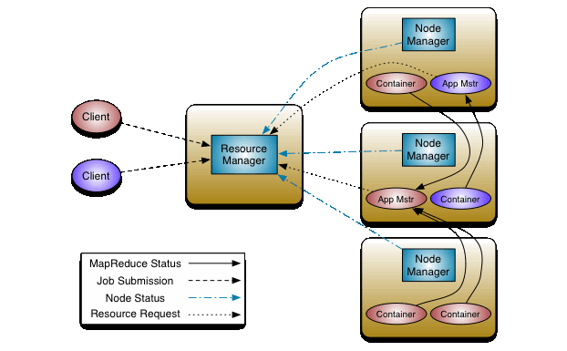

## Yarn 아키텍처
- YARN의 핵심 아이디어는 resource management와 job scheduling/monitoring 기능을 분리하는 것이다.  Resource Manager과 Node Manager의 형태는데이터 연산 프레임워크이다. 
- Resource Manager는 모든 애플리케이션 시스템간 중재할 수 있는 궁극적인 권한을 가지고 있다. Node Manager는 각 노드마다 존재하며 자원들(cpu, memory, disk, network)들을 모니터링하고 Resource Manager/Scheduler에게 보고해주는 역할을 한다.

 

 

- Resource Manager는 두 개의 주 요소로 구성되어 있다: Scheduler, Application Manager
Scheduler는 자원을 다양한 애플리케이션에 종속된 것들에 대해 자원을 할당해주는 역할을 한다. 모니터링, 트래킹 등 기능을 제외한 순수하게 할당해주는 역할을 수행한다. 또한, 실패에 대한 재시작에 대한 책임은 없다.
- Scheduler는 다양한 큐, 애플리케이션 등 여러 형태와 플러그 가능한 형태를 지닌다.
- Application Manager는 작업 제출을 수락하고, 애플리케이션별 Application Manager를 실행하기 위한 첫 번째 컨테이너를 정하며, 실패시 Application Manager 컨테이너를 다시 시작하기 위한 서비스를 제공한다.
- Yarn이 수천개가 넘는 노드를 관리해 줌으로써 단일의 거대한 클러스터를 구성할 수 있게 해준다.

