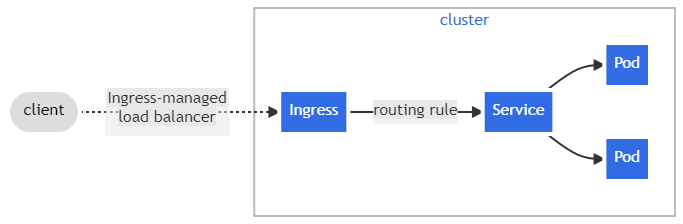

## Ingress
- HTTP 라우트를 외부 클러스터로부터 클러스터 내 서비스로 노출시키는 것이다. 트래픽 라우팅은 정의돈 것에 기반하여서 운영된다.(외부에서 접속가능한 url 사용)
- 외부 접근 가능한 url 기반이며 로드밸런스 트래픽, SSL/TLS 등 가상  호스팅 기반으로 구성된다.(ssl 인증서 처리)
- 임의의 포트, 프로토콜에 노출되는 것이 아니다.
- Ingress가 Gateway처럼 앞단에서 요청을 받은 후 L7(http) 계층에서 Host 단위나 Path 단위로 라우팅 처리를 하여 어떤 Service로 보내줄 지를 결정한다. 이후 L4(tcp/ip) 계층에서 Pod로 로드밸런싱을 진행하게 된다.(트래픽 로드밸런싱)



<br>


- 외부에서 사용자가 특정 경로로 접속하게 되면 인그레스를 통해 정의해둔 규칙에 따라 인그레스 컨트롤러가 동작하여 서비스에 맞는 파드로 연결해준다.

1. 파드 생성
  - 클러스터 내부에서만 접속
  

2. 서비스 연결(cluster type)
  - 클러스터 내부에서만 접속
  - 동일한 애플리케이션의 다수 파드의 접속을 용이하기 위해 서비스에 접속
  
3. 서비스 연결(nodeport type)
  - 외부 클라이언트가 서비스를 통해 내부 파드로 접속
  
4. 인그레스 컨트롤러 파드 배치
  - 인그레서 적용된 인그레스 컨트롤러 파드를 앞단에 배치하여 고급 라우팅 기능 제공
  
5. 인그레서 컨트롤러 이중화 구성
  - Active-standby 구성으로 파드 장애 대비
  
6. 인그레스 컨트롤러 파드 외부에 노출
  - 인그레서 컨트롤러 파드를 외부에서 접속하기 위한 노출
  - 인그레스 컨트롤러 노출 시, NodePort 보다는 좀 더 많은 기능을 제공하는 LoadBalancer 타입을 권장(80/443 포트 오픈 시)
  
7. 인그레스와 파드가 내부 연결의 효율화 방안
  - 
  


## The Ingress resource

```
apiVersion: networking.k8s.io/v1
kind: Ingress
metadata:
  name: minimal-ingress
  annotations:
    nginx.ingress.kubernetes.io/rewrite-target: /
spec:
  ingressClassName: nginx-example
  rules:
  - http:
      paths:
      - path: /testpath
        pathType: Prefix
        backend:
          service:
            name: test
            port:
              number: 80

```
- apiVersion, kind, metadata, spec 필드가 필요하며 유효한 DNS subdomain이 필요하다.
- spec에서 로드 밸런서 혹은 프록시 서버에 구성할 모든 정보가 필요하다.

## Ingress rules
- 규칙은 지정된 IP 주소를 통한 모든 인바운드 HTTP 트래픽에 적용될 Optional host가 필요하다.(www.google.com)
- 각 경로에는 service.name 및 service.port.name 또는 service.port.number로 정의된 관련 백엔드가 있다. 로드 밸런서가 참조 서비스로 트래픽을 보내기 전에 호스트와 경로가 모두 들어오는 요청의 내용과 일치해야 한다.

## Path Types
- ImplementationSpecific: IngressClass에 따라 결정된다. 이를 별도의 pathType으로 처리하거나 Prefix 또는 Exact 경로 유형과 동일하게 처리 가능
- Exact: 대소문자를 구분하여 URL 경로를 정확히 지킨다.
- Prefix: '/'에 의해 나눠지는 것을 기반으로 매칭된다.

## Ingress Class
- 하나의 클러스터에서 여러 인그레스 컨트롤러를 사용할 수 있도록 하기 위해 만들어진 API 리소스
- IngressClass = IngressController + Configuration

```
apiVersion: networking.k8s.io/v1
kind: IngressClass
metadata:
  name: external-lb
spec:
  controller: example.com/ingress-controller
  parameters:
    apiGroup: k8s.example.com
    kind: IngressParameters
    name: external-lb
```

<br/>

- spec.parameters필드는 다른 IngressClassdhk dusrhksehls rntjddmf wprhdgownsek
- 사용할 매개변수는 spec.controller필드에 지정하는 수신 컨트롤러에 따라 다르다.


## Ingress Class
- Ingress는 다른 컨트롤러에 대해 운영되고, 종종 다른 구성에 의해 실행된다. 각 Ingress는 클래스를 명시해야하고, IngressClass의 참조 자원은 클래스에 의해 시행되는 컨트롤러를 참조해야 한다.

```
apiVersion: networking.k8s.io/v1
kind: IngressClass
metadata:
  name: external-lb
spec:
  controller: example.com/ingress-controller
  parameters:
    apiGroup: k8s.example.com
    kind: IngressParameters
    name: external-lb
```

- spec.parameters 필드는 IngressClass와 관련된 구성을 제공하는 다른 참조 자원이다.

## Ingress Controller
- ingress 리소스가 동작하기 위해 인그레서 컨트롤러가 반드시 필요하다.
- 자동으로 실행되지 않으며 클러스터에 가장 적합한 컨트롤러를 선택하여 구현해야 한다.


## Types of Ingress
#### Ingress backend by a single service
- Kubernetes에는 하나의 서비스를 노출하는 개념이 있다. 또한 default backend를 규칙 없이 