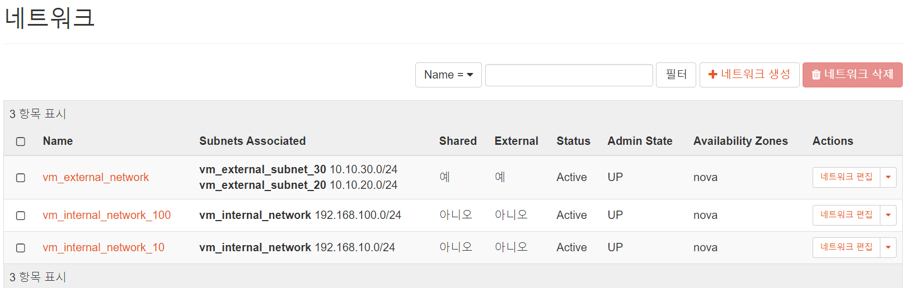
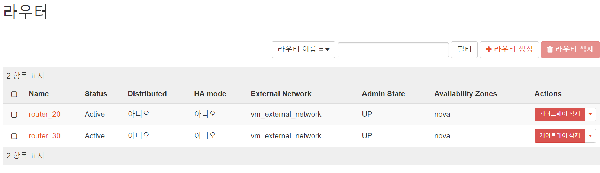

## OpenStack Network 구성
1. IP 대역
    - 물리 서버는 10번대(10.10.10.10) -> 물리 서버 자원을 클라우드화(External Network)
    - Floating IP는 20, 30번대(10.10.20.10) -> 클라우드화된 서버 자원과 VM을 연결해주는 역할(라우터)
    - Fixed IP (196.168) -> VM에 접근 가능한 IP(Internal Network)

2. Network
    ## 용어 정리
    
    - Controller Node: master node이자 물리 서버
    - Compute Node: worker node이자 물리 서버
    - NAT: external, internal network 통신 창구
    - Object Storage: 저장소
    - Block Storage: 저장소
    - Management network: 관리용 네트워크로 Nova, Neutron등 서로 API를 호출하는데 사용
    - Provider network: External network로 '구축'한 네트워크(물리서버로 구축)가 vm instance에 할당되는네트워크(서비스하는 사람이 '제공')
    - self-service network: 오픈스택을 '사용'하는 사용자가 자신만의 vm instance를 위한 네트워크를 구축할수 있는 네트워크(internal network???)
        - provider network를 기반으로 GRE, VXLAN 등의 터널링을 통해 구축

    ## 구성하기
    
    - Management Network: host에서 VM으로 접속할 수 있는 네트워크(192.168.)
    - Provier Network: VM 인스턴스를 10번대 외부 IP와 연결하게 해주는 20, 30번대 IP 사용
    - Internet: 물리 서버로 구성된 클라우드 자원으로 10번대 사용

    
    - Name: network 이름
    - Subnets Associated: 
        - vm_external: 외부 네트워크 이용
        - vm_internal: 내부 네트워크 이용
    - Shared: 프로젝트간 공유 유무
    - External: 내부망, 외부망 구분

    

    ## 네트워크 구축 과정
    1. 
        - 위 과정 실행 후 사진과 같이 구성된다: 10번대 인터넷(물리, 클라우드 자원)이 20번대 Provider Network를 통해서 Controller Node와 통신된다.
    2. 
        - eth0은 Management Network(host가 VM에 접근 가농)로 할당되어 있는 인터페이스인데 이를 통해 Tunnel Network와 같이 사용한다는 것을 알 수 있다.
    3. 
        - self-network network와 provider network를 연결해주는 라우터 생성
    4. 
        - 이 작업 이후 self-service network와 provider network가 연결되어 인터넷으로 트래픽이 나갈 수 있게 된다.
    5. 
        - worker 노드에 vxlan70 인터페이스가 생성되고 이를 통해 controller 노드와 연결이 된다.

3. Network Topology
    
    - vm_external_network: 물리서버이자 클라우드 자원이며 floating IP(라우터)를 통해 사용자의 VM과의 통신을 통해 연결된다
    - vm_internal_network_100: vm 인스턴스들의 네트워크이자(192.168.100.-) 100번대 IP를 사용 
    - vm_internal_network_10:vm 인스턴스들의 네트워크이자(192.168.10.-) 10번대 IP를 사용 
    - testInstance100_01: 네트워크와 라우터를 거쳐서 external_network와 연결된 VM

4. VM Instance 생성
    1. 키페어 생성
    2. 외부 네트워크 보장(10)
    3. 내부 네트워크 구성(100)
    4. floating IP 확보(20, 30)
    5. 인스턴스 생성
        1. 소스, 볼륨
        2. flavor
        3. 네트워크 설정(100)
        4. 보안 그룹 설정
        5. 생성
    6. Actions - 유동 ip 연결하기
        - 내외부 ip 연동(내부 -> 내부 -> 외부 연결 가능)
        - 같은 네트워크면 ssh로 연동 가능
    7. 인스턴스 삭제해도 volume 존재한다
    8. DNS 8.8.8.8 설정히 외부 통신 제한(보안그룹 설정)