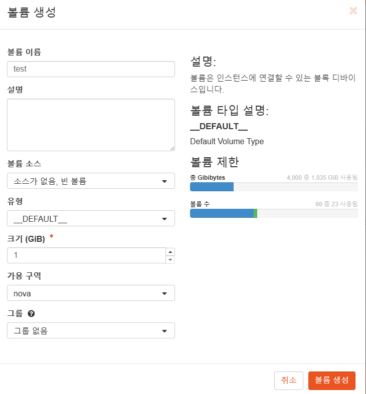
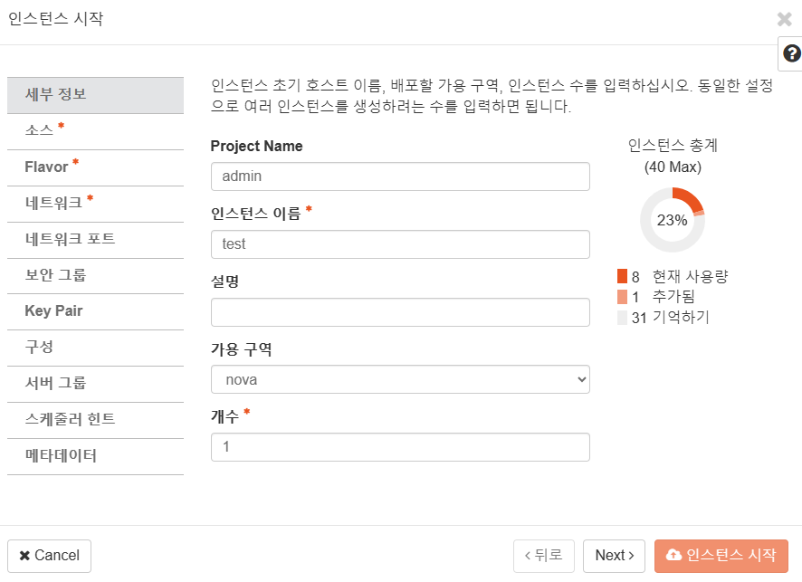
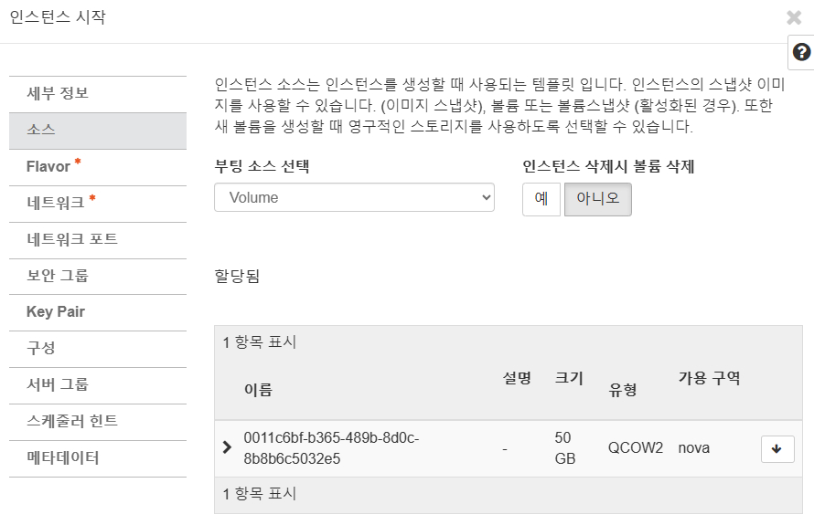
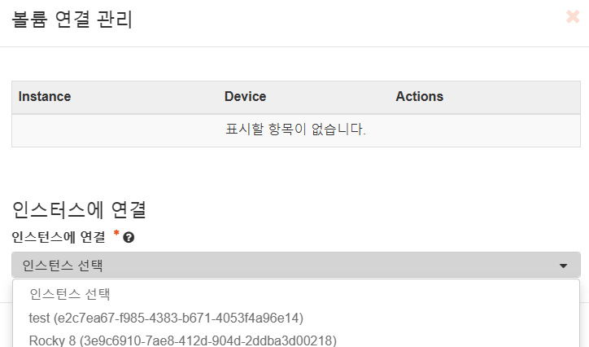

## Rocky 8 이미지 인스턴스
1. 문제
    - 관련 이미지로 인스턴스 생성시 ```Build of instance 9976ce1f-8651-44be-aa2a-83ec3b5a5b13 aborted: Volume 715d3fcb-8101-40a4-99f5-c7605be4a771 did not finish being created even after we waited 27 seconds or 10 attempts. And its status is error``` 관련 오류가 지속적으로 발생
2. 접근
    1. 독립적인 볼륩 생성
        
    2. 인스턴스 생성시 볼륨이 존재하지 않는 빈 인스턴스 생성
         
        
    3. 볼륨이 ummount된 인스턴스에 볼륨 mount하기
        
3. 연결
    - 다소 긴 시간 후 연결 완료

4. 후기
    - 로그 기반 추정상 이미지 파일 크기가 커서 timeout으로 생성 오류가 발생한다고 추정 -> 임의의 볼륨을 가진 instance와 새로운 volume 접합시키기